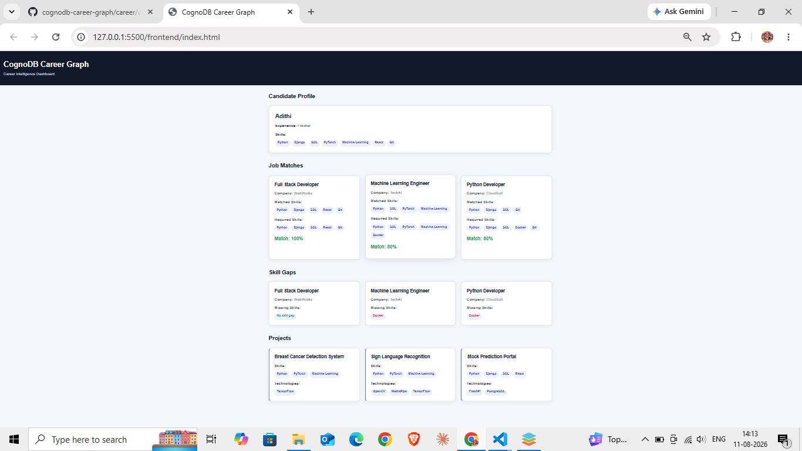
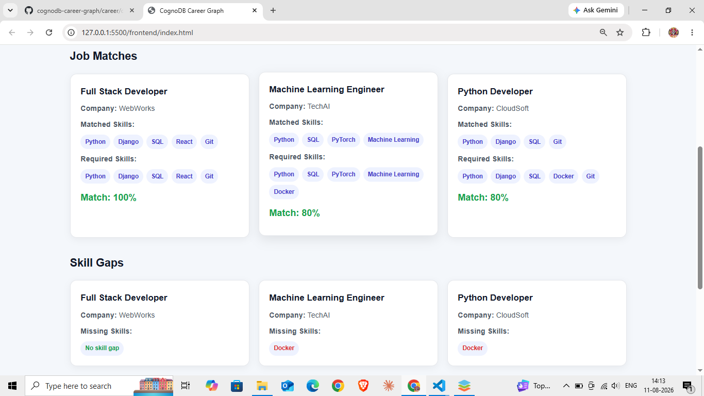

# CognoDB Career Graph

A career intelligence web application that helps users explore career paths, skills, projects, technologies, job opportunities, and skill gaps using a graph-based data model.

## 🚀 Overview

**CognoDB Career Graph** is a full-stack web application designed to represent career information as interconnected entities such as:

* Candidates
* Career roles
* Skills
* Technologies
* Projects
* Job opportunities

The application uses **Django REST Framework** for the backend API and a lightweight HTML/CSS/JavaScript frontend for the career intelligence dashboard. **CognoDB** is used as the graph database for storing and querying relationships between career entities.

The application analyzes a candidate's existing skills and projects to identify suitable job opportunities, calculate skill matches, and highlight missing skills.

## 🧠 Why a Graph Database?

Career intelligence is fundamentally relationship-driven. A candidate is connected to skills, projects are connected to skills and technologies, and jobs are connected to the skills they require.

CognoDB makes it straightforward to traverse these relationships across multiple hops. For example:

```text
Candidate → Project → Skill ← Job
```

This allows the application to identify jobs connected to skills demonstrated through projects built by a candidate.

In a relational database, the same analysis would require multiple tables and JOIN operations across candidates, projects, skills, technologies, and jobs. The graph model keeps these relationships explicit and makes relationship-based queries easier to express and extend.

## 🏗️ Architecture

```text
                    ┌─────────────────────┐
                    │     Frontend        │
                    │ HTML / CSS / JS     │
                    └──────────┬──────────┘
                               │
                               │ REST API
                               ▼
                    ┌─────────────────────┐
                    │      Backend        │
                    │ Django + DRF        │
                    └──────────┬──────────┘
                               │
                               │ Neo4j Driver
                               ▼
                    ┌─────────────────────┐
                    │      CognoDB        │
                    │   Graph Database    │
                    └─────────────────────┘
```

## 🕸️ Data Model

The application uses the following graph model:

```text
                         ┌─────────────┐
                         │  Candidate  │
                         └──────┬──────┘
                                │
                         HAS_SKILL
                                │
                                ▼
                         ┌─────────────┐
                         │    Skill    │
                         └──────▲──────┘
                                │
                             REQUIRES
                                │
                                │
                         ┌──────┴──────┐
                         │     Job     │
                         └─────────────┘


Candidate
    │
   BUILT
    ▼
 Project
    │
    ├── USES ──────────────→ Skill
    │
    └── USES_TECHNOLOGY ──→ Technology
```

### Node Types

* `Candidate`
* `Skill`
* `Job`
* `Project`
* `Technology`

### Relationship Types

* `HAS_SKILL`
* `BUILT`
* `USES`
* `USES_TECHNOLOGY`
* `REQUIRES`

## 🔍 Main Graph Queries

### Job Matching

The application finds the skills associated with a candidate and compares them with the skills required by each job.

```cypher
MATCH (c:Candidate {name: $candidate_name})-[:HAS_SKILL]->(s:Skill)
WITH c, collect(s.name) AS candidate_skills

MATCH (j:Job)-[:REQUIRES]->(required:Skill)
WITH j, candidate_skills, collect(required.name) AS required_skills

WITH
    j,
    candidate_skills,
    required_skills,
    [skill IN required_skills
     WHERE skill IN candidate_skills] AS matched_skills

RETURN
    j.title AS title,
    j.company AS company,
    matched_skills,
    required_skills
```

The candidate name is supplied as a parameter through the official Neo4j Python driver rather than being concatenated into the Cypher query.

### Multi-Hop Career Relationship

The application can traverse relationships between a candidate's projects, the skills used in those projects, and technologies used by those projects:

```cypher
MATCH (c:Candidate {name: $candidate_name})-[:BUILT]->(p:Project)
OPTIONAL MATCH (p)-[:USES]->(s:Skill)
OPTIONAL MATCH (p)-[:USES_TECHNOLOGY]->(t:Technology)

RETURN
    p.name AS name,
    collect(DISTINCT s.name) AS skills,
    collect(DISTINCT t.name) AS technologies
```

This demonstrates multi-hop traversal through the career graph.

## 🛠️ Technologies Used

### Frontend

* HTML5
* CSS3
* JavaScript

### Backend

* Python
* Django
* Django REST Framework
* django-cors-headers

### Graph Database

* CognoDB
* Neo4j Python Driver

### Other Tools

* Git
* GitHub
* Python virtual environment
* python-dotenv

## 📁 Project Structure

```text
cognodb-career-graph/
│
├── backend/
│   └── Backend configuration and API components
│
├── frontend/
│   └── HTML, CSS, JavaScript and dashboard
│
├── career/
│   ├── migrations/
│   ├── admin.py
│   ├── apps.py
│   ├── database.py
│   ├── models.py
│   ├── seed.py
│   ├── urls.py
│   ├── views.py
│   └── tests.py
│
├── manage.py
├── test_connection.py
├── requirements.txt
└── .gitignore
```

## ⚙️ Installation

### 1. Clone the repository

```bash
git clone https://github.com/pathakadithi/cognodb-career-graph.git
cd cognodb-career-graph
```

### 2. Create a virtual environment

```bash
python -m venv venv
```

Activate it on Windows:

```powershell
venv\Scripts\activate
```

### 3. Install dependencies

```bash
python -m pip install -r requirements.txt
```

### 4. Configure CognoDB

Create a `.env` file in the project root:

```env
COGNODB_URI=your_cognodb_uri
COGNODB_USERNAME=cognodb
COGNODB_PASSWORD=your_cognodb_password
```

The CognoDB connection details are read from environment variables.

**Never commit the `.env` file or database credentials to GitHub.**

### 5. Seed the database

The repository includes a seed script containing realistic career data.

Run:

```bash
python -m career.seed
```

The seed script creates the candidate, skills, jobs, projects, technologies, and their relationships.

### 6. Run Django migrations

```bash
python manage.py migrate
```

### 7. Start the backend

```bash
python manage.py runserver
```

The Django backend will normally be available at:

```text
http://127.0.0.1:8000/
```

### 8. Start the frontend

Open another terminal and navigate to the frontend directory:

```bash
cd frontend
```

Open the frontend using your preferred local development server.

The frontend communicates with the Django REST API to retrieve career data.

## 🔗 API

The Django backend exposes REST API endpoints used by the frontend.

The API layer uses:

* Django REST Framework
* CognoDB
* Neo4j Python Driver
* Parameterized Cypher queries

The application provides endpoints for:

* Candidate profile
* Job matches
* Skill gaps
* Candidate projects
* CognoDB health/connectivity

## 🧪 Testing

A CognoDB connection test is included in:

```text
test_connection.py
```

Run:

```bash
python test_connection.py
```

The API also includes a health-check endpoint that reports whether the CognoDB connection is available.

## 🔐 Security

Sensitive configuration such as database credentials is stored in environment variables.

The following files should **not** be committed:

```text
.env
venv/
__pycache__/
```

## 📸 Screenshots

### Dashboard



### Career Details



## 🚀 Future Improvements

Possible future enhancements include:

* More career and skill relationships
* Advanced career-path recommendations
* Skill-gap analysis
* Personalized career recommendations
* Job-market data integration
* Interactive graph visualization
* Authentication and user profiles
* Cloud deployment

## 👩‍💻 Author

**Pathak Adithi**

Computer Science graduate specializing in Artificial Intelligence and Machine Learning.

GitHub:
https://github.com/pathakadithi

---

⭐ If you find this project useful, feel free to explore the repository and provide feedback.

